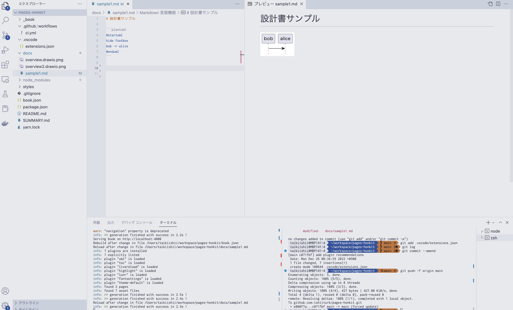

# 設計書に最適なドローツールは何なのかベストプラクティスを探す

終わらない旅です。

- ドキュメントとしての管理・公開スキーム
- シームレスなドキュメント作成と図の編集
- バージョン・変更管理

にフォーカスしたベスプラを今年も探してきました。

# 結論だけ知りたい人むけ

Markdown + Honkit + plantuml + VSCode + draw.ioプラグイン が結果最高でした 🎉

## Honkitについて

以前、gitbookで設計書を書くお話を[ブログ](https://akerun.hateblo.jp/entry/2017/12/26/110102)にしましたが、OSSとしての提供は終了してしまいました。

[Gitbook Legacy](https://github.com/GitbookIO/gitbook)


```
As the efforts of the GitBook team are focused on the GitBook.com platform, the CLI is no longer under active development.
All content supported by the CLI are mostly supported by our GitBook.com / GitHub integration.
Content hosted on the legacy.gitbook.com will continue working until further notice. For differences with the new vesion, check out our documentation.
```

ですが、非常にありがたいことにフォークした[Honkit](https://github.com/honkit/honkit)というツールがメンテされ続けています。

[移行も簡単](https://efcl.info/2020/06/19/githon/#:~:text=GitBook%E3%81%8B%E3%82%89HonKit%E3%81%B8%E3%81%AE,%E3%81%AA%E3%81%A9%E3%81%A7%E3%82%A4%E3%83%B3%E3%82%B9%E3%83%88%E3%83%BC%E3%83%AB%E3%81%97%E3%81%BE%E3%81%99%E3%80%82)なので弊社も光の速さで移行しました


## ドローツール

よく見かけるドローツール

- [MS Visio](https://www.microsoft.com/ja-jp/microsoft-365/visio/flowchart-software)
- [diagrams.net/draw.io](https://www.diagrams.net/)
- [cacoo](https://cacoo.com/ja/home)
- [miro](https://miro.com/ja/)
- [astah](https://astah.change-vision.com/ja/product/astah-uml.html)

パッケージソフトウェア・Webサービスそれぞれ特徴があります（お値段も）
描画するツールとしてはどれも良いのですが、

画像の編集とドキュメントへの埋めこみをシームレスにできるツールは残念ながら公式ではほぼありませんでした。

MS WordとVisioの組み合わせならできそうですが、ドキュメントが大きくなった際のWordの重さがボトルネックです（閲覧者にとってドキュメントを開くまでの時間は重要な体験）。

その中で、draw.io については以前の[ブログ](https://akerun.hateblo.jp/entry/2018/06/28/144947)でも紹介しましたが、更に進化を遂げていました。

- 比較的軽量
- 構成図を書くためのアセットが準備されている（アイコンやクラウドサービスのシンボルなど）
- 操作が直感的
- VSCodeのプラグインが最＆高 ← 主にココ

このプラグイン（非公式ながら）が、前述の「画像の編集とドキュメントへの埋めこみをシームレスに」を実現してくれます。

また、draw.io のもう一つ進化したポイントが、Webで使用した場合、同時編集が可能になりホワイトボードのような使い方ができるようになりました。これで他のツールに比べて弱点がほぼなくなったと思います。（ステマではありません）

[公式ブログより](https://www.diagrams.net/blog/gliffy-vs-drawio)


## Draw.io integration プラグイン

図を保存するディレクトリに、 [ファイル名].drawio.[画像ファイル拡張子] の形式でファイルを作成します。例えば `overview.drawio.png` とか。

そうすると、あら不思議。VSCode上でdrawioを操作して作図できるようになります。


これで、VSCode上で

- Draw.ioインテグレーションで図を作成
- Markdownでドキュメント作成

が可能になりました。個人的にとても気持ちいい。

## コードベースUML

システム構成やクラス図など配置に気を遣う・おしゃれに書きたい場合はドローツールをつかいたいですが、シーケンス図・アクティビティ図はコードベースで書くのがおすすめです。
理由は主に経験則ですが、ちょい変で構成全体に手が入るような場合、コードベースで書いておいた方がメンテしやすいです。好みもあると思います。

現在主流は以下の2つ。

- plantuml
- mermaid

この中では plantuml に軍配です。mermaidは表現が狭い。やたら図がでかくなるなど、まだまだ課題ありです。GithubのREADMEページがmermaid記法をサポートしたので、ちょっとした図を仕込むにはいいかもしれません。plantumlもサポートしてくれ。

Honkitはumlプラグインを導入することで、plantuml形式で書けます。また、Markdown Preview Enhancedを追加すれば、Markdownプレビューで一緒に表示してくれます。便利です。



## ドキュメントの公開

Honkitでビルドした静的ファイルをホスティングすれば、Webブラウザで閲覧できる設計書のできあがりです。

簡単にやるなら GithubActionsでビルドしてGitHubPagesで公開するのが最もお手軽です。


ただし、GithubPagesはユーザー認証できない（たぶん）ので、情報漏えいにご注意ください。
さすがに設計書を一般公開するわけにはいかないので、弊社では AWSを活用し、S3にデプロイ・Cloud Frontで認証+HTTPSでのアクセスになるよう設定しています。


今回このブログもHonkit形式にして[Github](https://github.com/ishiiturk/pages-honkit)で公開してみました。

完成形がイメージできてるのもありますが、とても簡単に公開までできました。

# 終わらない旅

ツールは日々進化するし、使い慣れたツールが突然使えなくなることもある。ベスプラ探しの旅は来年も続きます。
